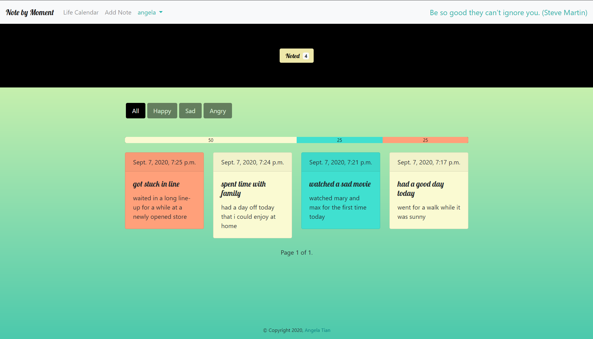
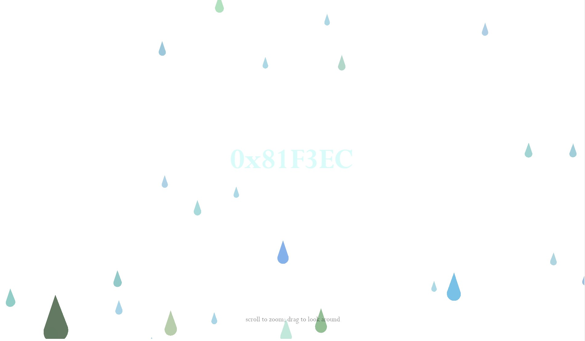
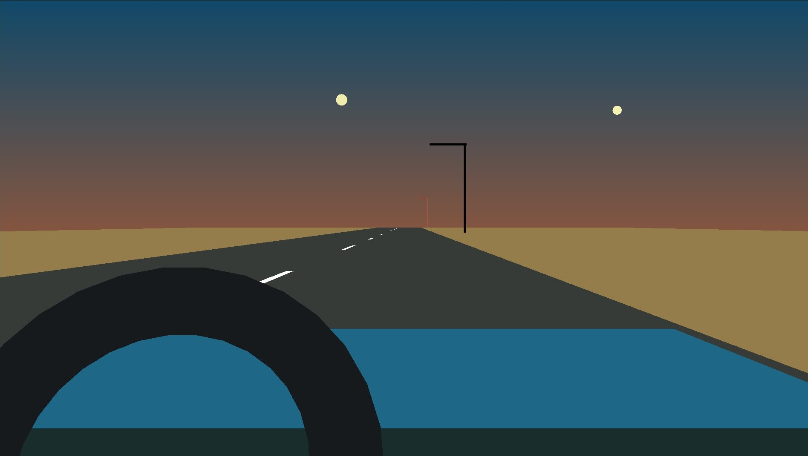
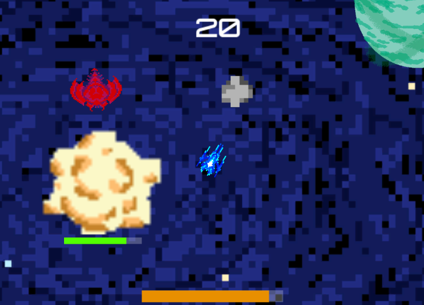
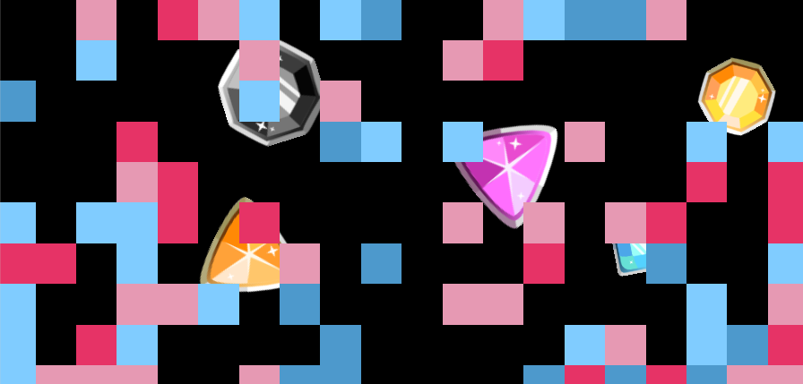
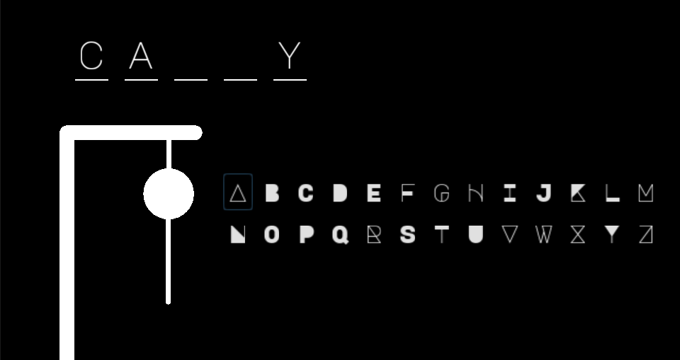
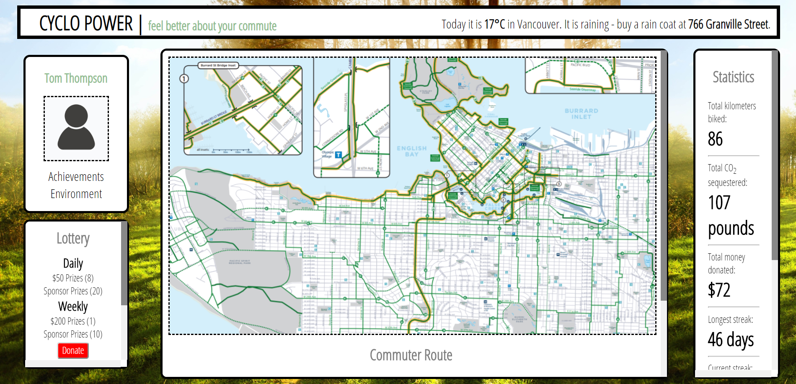
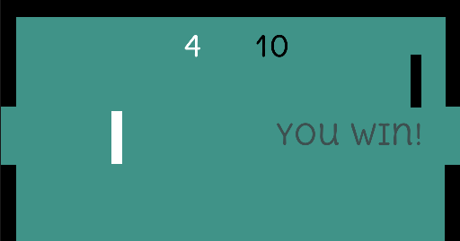

<!-- Main -->

<!-- One -->
<section id="one">
	

		
<strong>Attended</strong> Distributed Summer 2020, nwHacks 2020, UBC Local Hack Day 2019, Girls in Tech Vancouver Hacking for Humanity Hackathon 2019, cmd-f 2019, UBC Blockathon 2019,  BC Game Jam 2019, UBC Local Hack Day 2018, HallowHacks 2018, UBC Local Hack Day 2018

	

</section>

<section id="one" class="tiles">
  <article>
    
      
    
    <header class="major">
				<h3>Note by Moment</h3>
        
A website made in Django for noting down the small things in life.
 
				<ul class="actions">
          <li><a href="https://github.com/tiangela1027/Note-by-Moment" target="_blank" class="button">GitHub</a></li>
					<li><a href="https://note-by-moment.herokuapp.com/" target="_blank" class="button">Try It</a></li>
				</ul>
				</header>
  </article>
  <article>
    
      
    
    <header class="major">
				<h3>Paint Drop</h3>
        
An interactive 3D colour picker.
 
				<ul class="actions">
          <li><a href="https://github.com/tiangela1027/Paint-Drop" target="_blank" class="button">GitHub</a></li>
					<li><a href="./paint-drop/paintdrop.html" target="_blank" class="button">Try It</a></li>
				</ul>
				</header>
  </article>
  <article>
    
      
    
    <header class="major">
				<h3>Sunset Drive</h3>
        
A 3D simulation of a drive at sunset.
 
				<ul class="actions">
          <li><a href="https://github.com/tiangela1027/Sunset-Drive" target="_blank" class="button">GitHub</a></li>
					<li><a href="./sunset-drive/index.html" target="_blank" class="button">Try It</a></li>
				</ul>
				</header>
  </article>
  <article>
    
      
    
    <header class="major">
					<h3>The Last Frontier</h3>
				  
Made for BC Game Jam 2019.
 
				  <ul class="actions">
					<li><a href="https://github.com/tiangela1027/The-Last-Frontier" target="_blank" class="button">GitHub</a></li>
					<li><a href="./assets/zip/lastfrontier_win.zip" download class="button icon fa-download">Windows</a></li>
				</ul></header>
  </article>
  <article>
    
      
    
    <header class="major">
      	<h3>Colour Mine</h3>
	  	  
Made for UBC LHD - Build Day Hackathon 2019.
 
			  <ul class="actions">
				<li><a href="https://github.com/tiangela1027/Colour-Mine" target="_blank" class="button">GitHub</a></li>
			</ul>
    </header>
  </article>
  <article>
    
      
    
    <header class="major">
					<h3>Hangman</h3>
				  <ul class="actions">
					<li><a href="https://github.com/tiangela1027/Hangman" target="_blank" class="button">GitHub</a></li>
					<li><a href="./assets/zip/hangman_win.zip" download class="button icon fa-download">Windows</a></li>
				</ul></header>
  </article>
  <article>
    
      
    
    <header class="major">
					<h3>Cyclo Power</h3>
				  
Made for HallowHacks 2018 (second place).
 
				  <ul class="actions">
					<li><a href="https://github.com/tiangela1027/Cyclo-Power" target="_blank" class="button">GitHub</a></li>
				</ul>
				</header>
  </article>
  <article>
    
      
    
    <header class="major">
					<h3>Pong</h3>
				  <ul class="actions">
					<li><a href="https://github.com/tiangela1027/Pong" target="_blank" class="button">GitHub</a></li>
					<li><a href="./assets/zip/pong_win.zip" download class="button icon fa-download">Windows</a></li>
				</ul>
				</header>
  </article>
</section>

